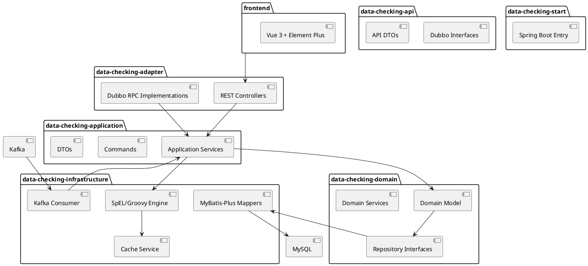
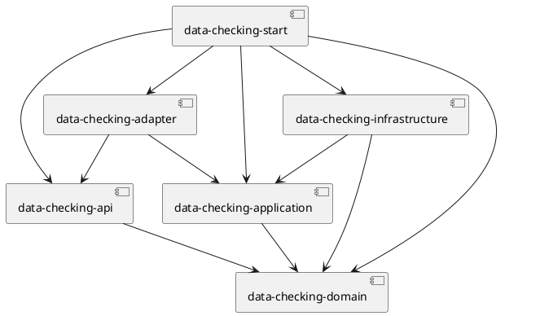
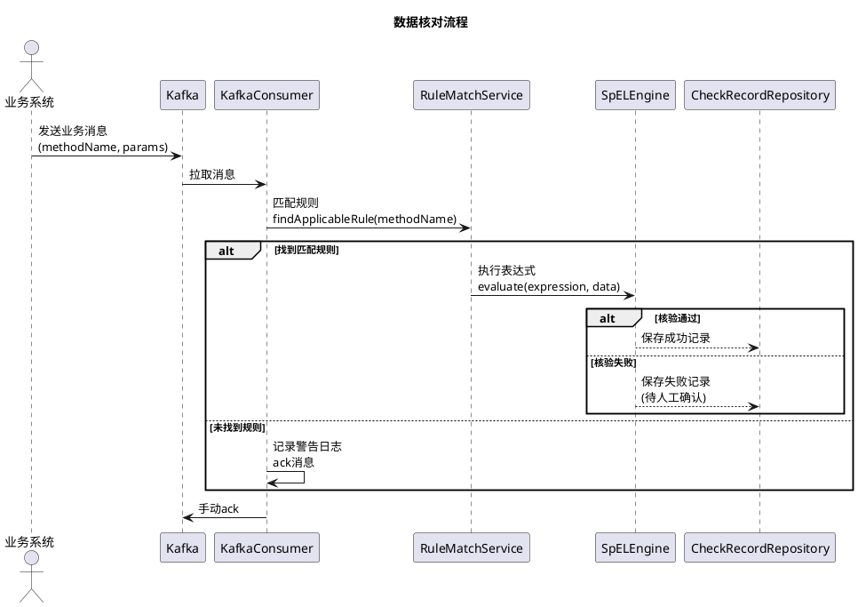
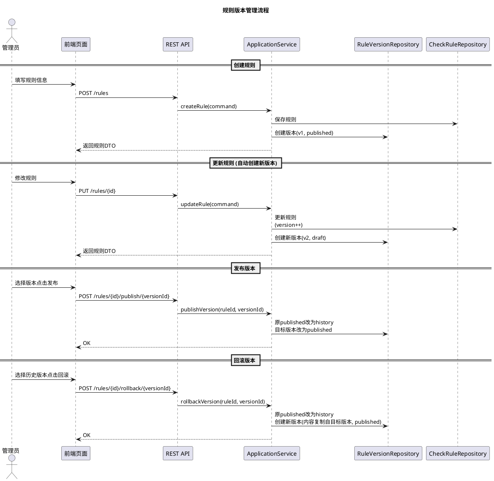
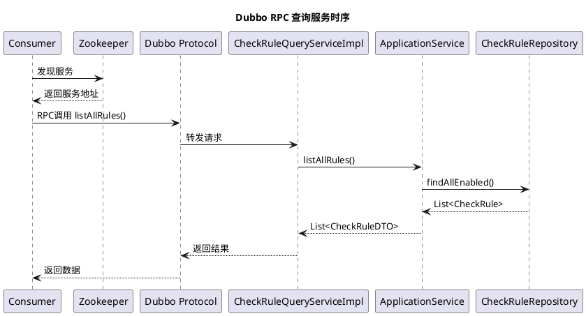

# Data Checking 技术文档

## 1. 项目概述

Data Checking 是一个实时数据核对服务系统，基于 Spring Boot 3.5.7 + Java 21 构建。系统通过消费 Kafka 消息，利用 SpEL/Groovy 规则引擎核验数据，支持版本管理、发布回滚等企业级功能。

### 核心能力

- **Kafka 消费**：批量消费消息，手动 ack，确保数据不丢失
- **规则引擎**：SpEL（简单条件）+ Groovy（复杂逻辑），预编译缓存
- **版本管理**：规则版本控制，支持发布和回滚
- **指标上报**：Micrometer + Prometheus 监控
- **持久化**：失败数据落库 MySQL，支持人工确认

---

## 2. 系统架构



### 模块依赖关系



---

## 3. 技术栈

| 层级 | 技术 | 版本 |
|------|------|------|
| 框架 | Spring Boot | 3.5.7 |
| 语言 | Java | 21 |
| 构建 | Maven | 3.9+ |
| 消息队列 | Kafka | 3.x |
| RPC | Dubbo | 3.3.5 |
| ORM | MyBatis-Plus | 3.5.5 |
| 缓存 | Redis + ConcurrentHashMap | - |
| 监控 | Micrometer + Prometheus | - |
| 前端 | Vue 3 + Element Plus | 3.x |

---

## 4. 数据模型

### 4.1 规则表 (t_check_rule)

```sql
CREATE TABLE t_check_rule (
    id BIGINT AUTO_INCREMENT PRIMARY KEY,
    rule_name VARCHAR(100) NOT NULL COMMENT '规则名称',
    method_pattern VARCHAR(200) NOT NULL COMMENT '方法匹配模式',
    match_type INT NOT NULL COMMENT '匹配类型: 0=精确 1=通配 2=正则',
    rule_type VARCHAR(20) NOT NULL COMMENT '引擎类型: SpEL/Groovy',
    expression TEXT NOT NULL COMMENT '核验表达式',
    priority INT DEFAULT 0 COMMENT '优先级',
    enabled BOOLEAN DEFAULT TRUE COMMENT '是否启用',
    version INT DEFAULT 1 COMMENT '乐观锁版本',
    created_at DATETIME DEFAULT CURRENT_TIMESTAMP,
    updated_at DATETIME DEFAULT CURRENT_TIMESTAMP ON UPDATE CURRENT_TIMESTAMP
);
```

### 4.2 规则版本表 (t_rule_version)

```sql
CREATE TABLE t_rule_version (
    id BIGINT AUTO_INCREMENT PRIMARY KEY,
    rule_id BIGINT NOT NULL COMMENT '规则ID',
    rule_name VARCHAR(100) COMMENT '规则名称',
    method_pattern VARCHAR(200) COMMENT '方法匹配',
    match_type INT COMMENT '匹配类型',
    rule_type VARCHAR(20) COMMENT '引擎类型',
    expression TEXT COMMENT '核验表达式',
    priority INT DEFAULT 0 COMMENT '优先级',
    enabled BOOLEAN DEFAULT TRUE COMMENT '是否启用',
    rule_version INT COMMENT '版本号',
    status VARCHAR(20) DEFAULT 'draft' COMMENT '状态: draft/current/published',
    published_at DATETIME COMMENT '发布时间',
    created_by VARCHAR(50) COMMENT '创建人',
    created_at DATETIME DEFAULT CURRENT_TIMESTAMP,
    INDEX idx_rule_id (rule_id),
    INDEX idx_status (status)
);
```

### 4.3 核对记录表 (t_check_record)

```sql
CREATE TABLE t_check_record (
    id BIGINT AUTO_INCREMENT PRIMARY KEY,
    trace_id VARCHAR(64) NOT NULL COMMENT '链路追踪ID',
    rule_id BIGINT NOT NULL COMMENT '规则ID',
    method_name VARCHAR(200) NOT NULL COMMENT '业务方法名',
    check_result INT NOT NULL COMMENT '核对结果: 0=成功 1=失败',
    expression TEXT COMMENT '执行的表达式',
    input_params TEXT COMMENT '输入参数JSON',
    return_data TEXT COMMENT '返回数据JSON',
    fail_reason TEXT COMMENT '失败原因',
    confirm_status INT DEFAULT 0 COMMENT '确认状态: 0=待确认 1=正常 2=异常',
    confirm_user VARCHAR(50) COMMENT '确认人',
    confirm_remark VARCHAR(500) COMMENT '确认备注',
    confirm_at DATETIME COMMENT '确认时间',
    created_at DATETIME DEFAULT CURRENT_TIMESTAMP,
    INDEX idx_rule_id (rule_id),
    INDEX idx_trace_id (trace_id),
    INDEX idx_confirm_status (confirm_status)
);
```

---

## 5. 核心流程

### 5.1 数据核对流程



### 5.2 规则版本管理流程



### 5.3 Dubbo RPC 服务时序



---

## 6. API 接口

### 6.1 规则管理 REST API

| 方法 | 路径 | 说明 |
|------|------|------|
| GET | `/api/data-check/rules` | 查询所有规则 |
| GET | `/api/data-check/rules/{id}` | 根据ID查询规则 |
| POST | `/api/data-check/rules` | 创建规则 |
| PUT | `/api/data-check/rules/{id}` | 更新规则 |
| DELETE | `/api/data-check/rules/{id}` | 删除规则 |
| GET | `/api/data-check/rules/{id}/versions` | 获取版本列表 |
| POST | `/api/data-check/rules/{id}/publish/{versionId}` | 发布版本 |
| POST | `/api/data-check/rules/{id}/rollback/{versionId}` | 回滚版本 |

### 6.2 核对记录 REST API

| 方法 | 路径 | 说明 |
|------|------|------|
| GET | `/api/data-check/records/pending` | 分页查询待确认记录 |
| POST | `/api/data-check/records/confirm` | 人工确认核对结果 |

### 6.3 监控指标 API

| 方法 | 路径 | 说明 |
|------|------|------|
| GET | `/api/data-check/metrics` | 获取系统指标 |

### 6.4 Dubbo RPC 接口

```java
public interface CheckRuleQueryService {
    List<CheckRuleDTO> listAllRules();
    CheckRuleDTO getRuleById(Long id);
}
```

- **版本**: 1.0.0
- **分组**: data-checking
- **协议**: Dubbo
- **端口**: 20880

---

## 7. 前端功能

### 7.1 页面结构

```
frontend/
├── src/
│   ├── api/
│   │   └── index.js          # API 封装
│   ├── router/
│   │   └── index.js          # 路由配置
│   ├── views/
│   │   ├── RuleList.vue      # 规则列表页
│   │   ├── RuleEditor.vue    # 规则编辑页
│   │   └── RuleVersion.vue   # 版本管理页
│   ├── App.vue
│   └── main.js
└── package.json
```

### 7.2 功能说明

#### 规则列表页
- 展示所有规则基本信息
- 支持新增、编辑、删除、版本管理操作

#### 规则编辑页
- 支持新增和编辑两种模式
- 配置字段：规则名称、方法匹配、匹配类型、引擎类型、核验表达式、优先级、启用状态

#### 版本管理页
- 展示版本历史列表
- 支持发布和回滚操作
- 显示当前生效版本信息

---

## 8. 版本管理功能详解

### 8.1 状态流转

```
draft --> current --> published
  ^          |           |
  |          v           |
  +---- history <--------+
```

- **draft**: 草稿状态，更新规则时自动创建
- **current**: 当前版本（已发布）
- **published**: 已发布生效
- **history**: 历史版本

### 8.2 发布规则

1. 将原 published 版本状态改为 history
2. 将目标版本状态改为 published
3. 记录发布时间

### 8.3 回滚规则

1. 将原 published 版本状态改为 history
2. 复制目标版本内容创建新版本（版本号递增）
3. 新版本状态设为 published

---

## 9. 配置说明

### 9.1 多环境配置

| 文件 | 环境 | 说明 |
|------|------|------|
| `application.yml` | 公共 | 默认配置 |
| `application-dev.yml` | 开发 | localhost 连接 |
| `application-test.yml` | 测试 | 测试服务器 |
| `application-pre.yml` | 预发布 | 3节点集群 |
| `application-prod.yml` | 生产 | 生产配置 |

### 9.2 启动方式

```bash
# 打包
mvn clean package -pl data-checking-start

# 运行（指定环境）
mvn spring-boot:run -pl data-checking-start -Dspring-boot.run.profiles=dev

# 或打包后运行
java -jar data-checking-start.jar --spring.profiles.active=dev
```

### 9.3 敏感配置

数据库密码、Redis 密码等敏感信息通过环境变量或命令行参数注入：

```bash
java -jar data-checking-start.jar --spring.datasource.password=xxx
```

---

## 10. 监控指标

系统通过 Micrometer 上报以下指标到 Prometheus：

| 指标名 | 类型 | 说明 |
|--------|------|------|
| `data_check_total` | Counter | 核对总数 |
| `data_check_success_total` | Counter | 核对成功数 |
| `data_check_fail_total` | Counter | 核对失败数 |
| `data_check_pending_total` | Gauge | 待确认数量 |

Prometheus 端点：`/actuator/prometheus`

---

## 11. 附录

### 11.1 项目结构

```
data-checking/
├── data-checking-domain/          # 领域层
│   └── src/main/java/.../
│       └── domain/
│           ├── model/              # 领域模型
│           ├── repository/        # 仓储接口
│           ├── service/           # 领域服务
│           └── event/             # 领域事件
├── data-checking-application/     # 应用层
│   └── src/main/java/.../
│       └── application/
│           ├── command/            # 命令对象
│           ├── dto/                # 数据传输对象
│           └── service/            # 应用服务
├── data-checking-infrastructure/  # 基础设施层
│   └── src/main/java/.../
│       └── infrastructure/
│           ├── kafka/              # Kafka消费
│           ├── persistence/       # MyBatis持久化
│           ├── engine/            # 规则引擎
│           └── cache/             # 缓存服务
├── data-checking-adapter/         # 适配层
│   └── src/main/java/.../
│       └── adapter/
│           ├── web/               # REST控制器
│           └── dubbo/             # Dubbo实现
├── data-checking-api/             # API定义
│   └── src/main/java/.../
│       └── api/
│           ├── dto/               # API DTO
│           └── *.java             # RPC接口
├── data-checking-start/           # 启动模块
│   └── src/main/
│       ├── java/                  # 入口类
│       └── resources/             # 配置文件
├── frontend/                      # 前端项目
│   └── src/
│       ├── views/                 # 页面组件
│       ├── api/                   # API调用
│       └── router/                # 路由配置
└── sql/                           # SQL脚本
    └── init.sql
```

### 11.2 核心技术亮点

1. **三级缓存**：ConcurrentHashMap(L1) → Redis(L2) → MySQL(L3)
2. **表达式预编译**：SpEL/Groovy 表达式编译后缓存，避免重复解析
3. **DDD 架构**：清晰的领域边界，依赖方向正确
4. **事件驱动**：规则变更发布事件，触发索引重建
5. **乐观锁**：通过 version 字段防止并发更新冲突